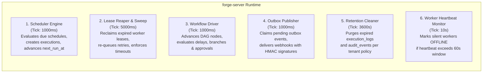
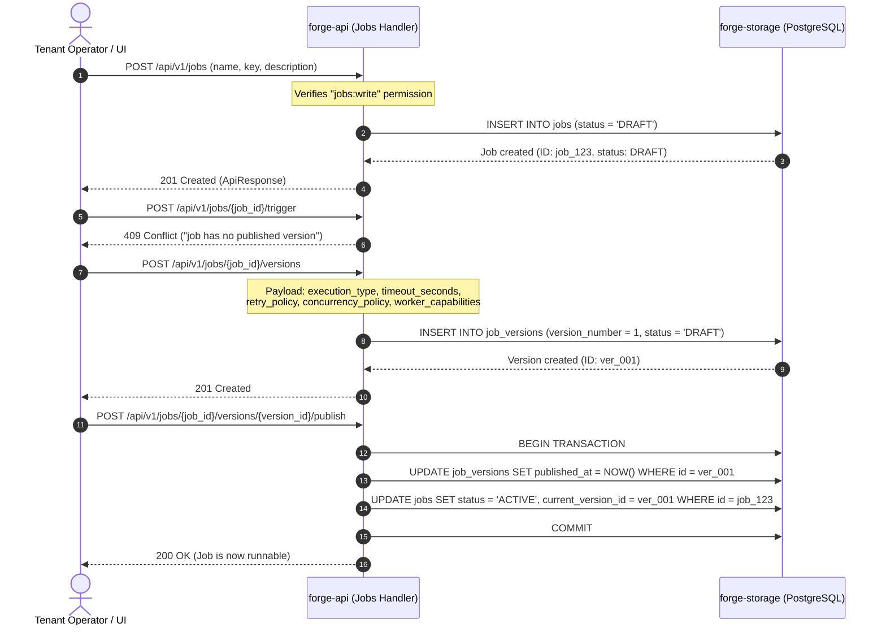
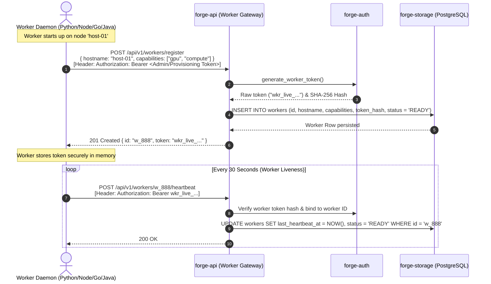
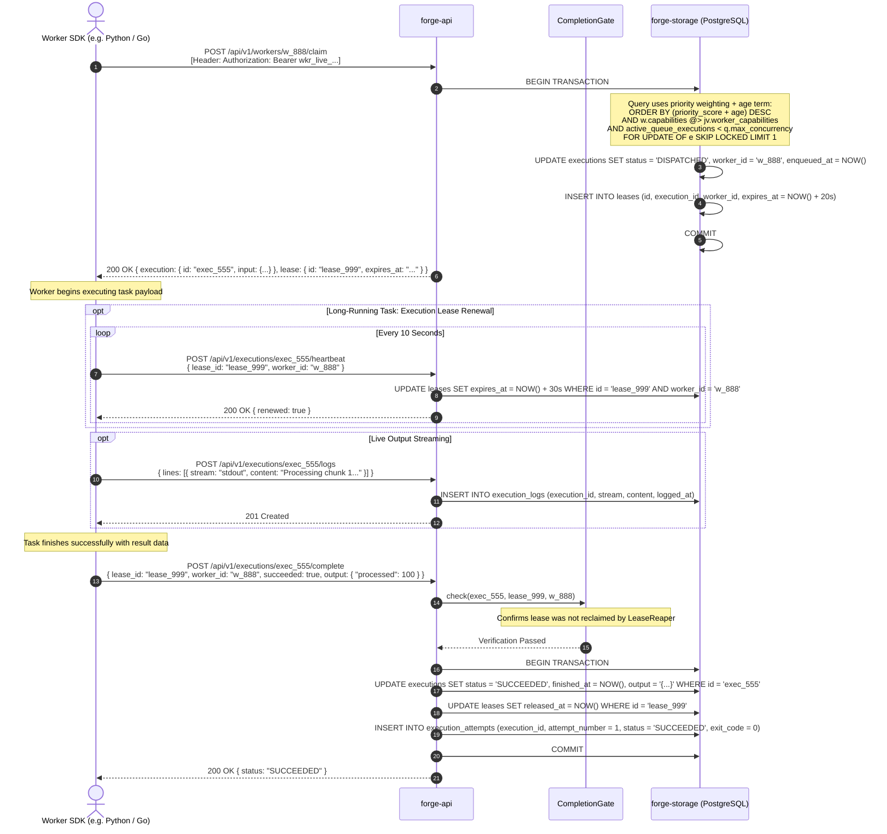
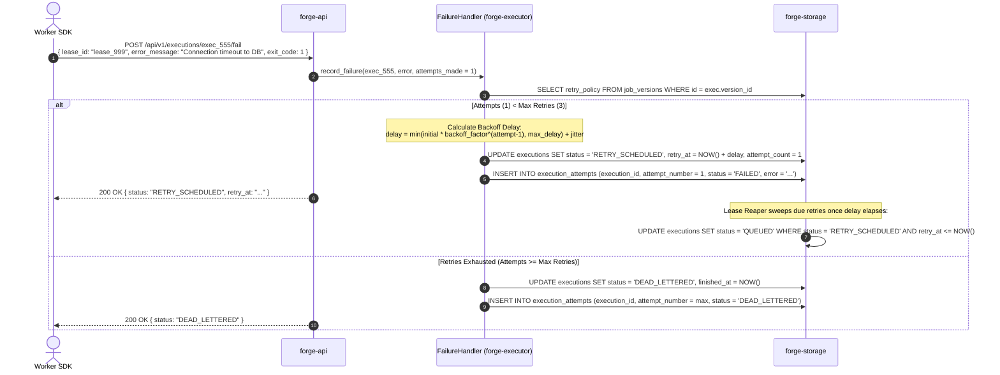
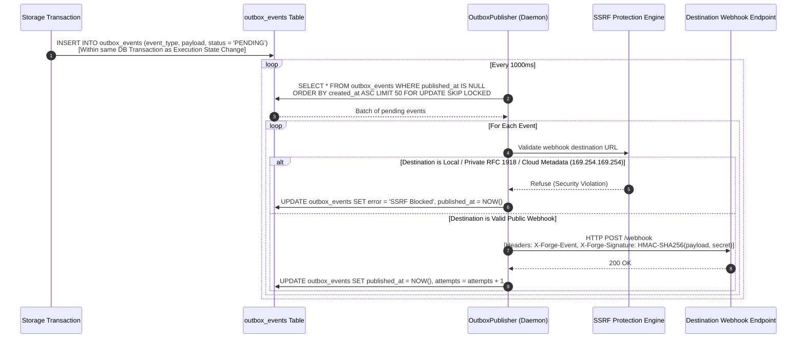
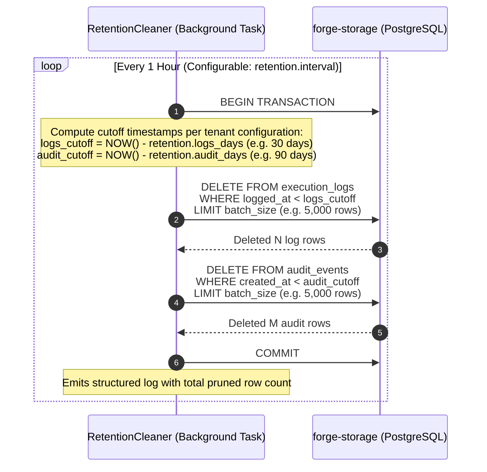
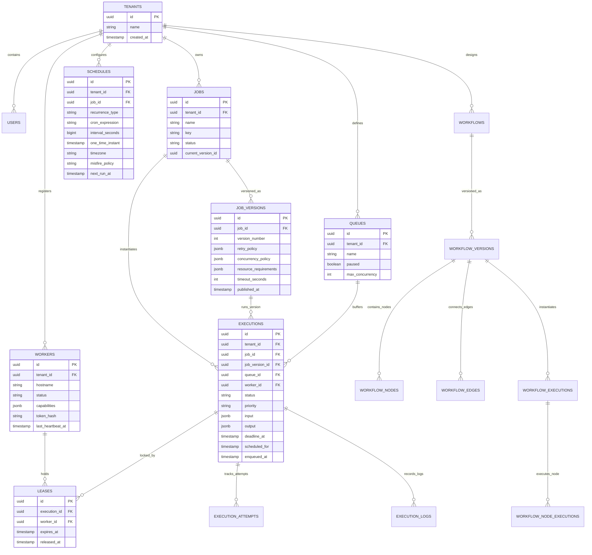

# Forge Architecture & Complete End-to-End Execution Flows

This document provides a comprehensive technical breakdown of how the **Forge** job and workflow orchestration platform works. It details the system architecture, component boundaries, background daemon loops, and complete sequence diagrams for every runtime flow.

---

## 1. System Architecture & Component Topology

Forge is engineered with a **Hexagonal (Ports & Adapters) architecture** in Rust. The domain core is decoupled from transport protocols, external databases, and environment variables.

### 1.1 High-Level Component Topology

```mermaid
flowchart TD
    subgraph Clients["Clients & Presentation"]
        UI["Web UI (Next.js 16 / TypeScript)<br/>30 Production Routes"]
        SDK_PY["Python Worker SDK"]
        SDK_TS["Node.js Worker SDK"]
        SDK_GO["Go Worker SDK"]
        SDK_JA["Java Worker SDK"]
        CLI["Forge CLI Client"]
    end

    subgraph Server["Forge Server (forge-server / Axum)"]
        subgraph APILayer["API & Security Layer (forge-api / forge-auth)"]
            Router["Axum HTTP Router & OpenAPI 3.1"]
            Auth["JWT & HMAC API Key Verifier"]
            WorkerAuth["Scoped Worker Token Verifier"]
            SSRF["SSRF Guard (RFC 1918 / Cloud Metadata Filter)"]
            RateLimit["Sliding Window Rate Limiter"]
        end

        subgraph CoreEngines["Core Domain & Orchestration Engines"]
            Scheduler["Scheduler Engine (forge-scheduler)"]
            WFDriver["Workflow Driver (forge-executor)"]
            Reaper["Lease Reaper & Recovery (forge-executor)"]
            Gate["Completion Gate (forge-executor)"]
            OutboxPub["Outbox Publisher (forge-events)"]
            RetPurge["Retention Cleaner (forge-server)"]
            Obs["Metrics & Tracing (forge-observability)"]
        end

        subgraph StorageLayer["Persistence Layer (forge-storage / SQLx)"]
            JobRepo["Job & Version Repository"]
            ExecRepo["Execution Repository"]
            SchedRepo["Schedule Repository"]
            WFRepo["Workflow Repository"]
            LeaseRepo["Lease Repository"]
            WorkerRepo["Worker Repository"]
            QueueRepo["Queue Repository"]
            OutboxRepo["Outbox Repository"]
            AuditRepo["Audit Repository"]
        end
    end

    subgraph Database["Primary Data Store"]
        PG[("PostgreSQL 15+<br/>• ACID Transactions<br/>• FOR UPDATE SKIP LOCKED<br/>• GIN JSONB Indexes<br/>• Row-level Multi-Tenancy")]
    end

    subgraph Outbound["External Sinks"]
        Webhooks["Customer Webhook Endpoints"]
        Alerts["Incident & Alert Channels"]
        Prometheus["Prometheus / OTel Collectors"]
    end

    UI --> Router
    CLI --> Router
    SDK_PY --> Router
    SDK_TS --> Router
    SDK_GO --> Router
    SDK_JA --> Router

    Router --> Auth
    Router --> WorkerAuth
    Auth --> CoreEngines
    WorkerAuth --> CoreEngines
    SSRF --> Webhooks

    Scheduler --> SchedRepo
    Scheduler --> ExecRepo
    WFDriver --> WFRepo
    WFDriver --> ExecRepo
    Reaper --> LeaseRepo
    Reaper --> ExecRepo
    Gate --> LeaseRepo
    OutboxPub --> OutboxRepo
    RetPurge --> ExecRepo
    RetPurge --> AuditRepo

    JobRepo --> PG
    ExecRepo --> PG
    SchedRepo --> PG
    WFRepo --> PG
    LeaseRepo --> PG
    WorkerRepo --> PG
    QueueRepo --> PG
    OutboxRepo --> PG
    AuditRepo --> PG

    OutboxPub --> Webhooks
    Obs --> Prometheus
    CoreEngines --> Alerts
```



---

### 1.2 Rust Workspace Crate Responsibilities

The codebase is structured into modular crates enforcing unidirectional dependencies:

| Crate | Purpose | Key Dependencies | Invariants |
|---|---|---|---|
| **`forge-domain`** | Pure business entities, state machines, validation rules, policy calculations. | None (zero I/O, zero network, zero SQL). | Contains no SQL, HTTP, or async primitives. 100% deterministic. |
| **`forge-storage`** | PostgreSQL persistence, schema migrations (001–017), repositories, transactional queries using `FOR UPDATE SKIP LOCKED`. | `sqlx`, `forge-domain`, `tokio` | Enforces multi-tenant isolation (`tenant_id`) on all queries. |
| **`forge-scheduler`** | CRON, interval, one-time calculation, IANA timezone resolution, DST gap/fold handling, misfire policies. | `chrono`, `chrono-tz`, `cron`, `forge-domain` | Independent of HTTP transport. Evaluates due occurrences algorithmically. |
| **`forge-executor`** | Execution lifecycle, worker protocol, lease acquisition/renewal, lease reaper, retry backoff, workflow execution graph. | `forge-domain`, `forge-storage` | Authoritative for task states, timeout sweeps, and completion gates. |
| **`forge-events`** | Transactional outbox publisher, domain event definitions, webhook dispatching with SSRF protection. | `reqwest`, `forge-domain`, `forge-storage` | Guarantees at-least-once delivery with exponential backoff. |
| **`forge-auth`** | Password hashing (Argon2id), JWT issuance/verification, worker tokens, HMAC-SHA256 API key hashing, RBAC permissions. | `jsonwebtoken`, `argon2`, `sha2`, `hmac` | Least-privilege enforcement. Worker tokens cannot become tenant admins. |
| **`forge-observability`**| Prometheus metrics registry, structured tracing subscriber, latency tracking. | `tracing`, `metrics`, `prometheus` | Low-overhead instrumentation across all critical execution paths. |
| **`forge-api`** | Axum REST router, OpenAPI 3.1 specification, request extractors, response envelopes, error mapping. | `axum`, all internal crates | Strict request validation; maps errors to standard JSON API envelopes. |
| **`forge-server`** | Application binary; coordinates server startup, database migrations, signal handling, and 6 background daemon loops. | `tokio`, `clap`, all internal crates | Graceful shutdown; failure of any background task triggers clean process termination. |

---

## 2. Background Daemon Loops (Runtime Composition)

Alongside the Axum HTTP API, `forge-server` executes six dedicated background loops:



---

## 3. Detailed Sequence Diagrams of Complete System Flows

### Flow 1: Job Authoring, Versioning & Immutability

Jobs in Forge are immutable across versions. Publishing a version guarantees that past executions remain reproducible even if the job template changes.



---

### Flow 2: Worker Registration, Authentication & Heartbeat Protocol

Workers possess scoped, least-privilege tokens. A worker cannot access tenant administrative data, mint users, or alter schedules.



---

### Flow 3: Scheduler Engine & Occurrence Evaluation Loop

The scheduler daemon runs concurrently across multiple server replicas, safely coordinating via PostgreSQL locks without external lock managers.

```mermaid
sequenceDiagram
    autonumber
    participant Loop as Scheduler Daemon Loop
    participant Engine as SchedulerEngine
    participant Cal as Recurrence Calculator (Cron/Interval/OneTime)
    participant Storage as forge-storage (PostgreSQL)
    participant Outbox as outbox_events

    loop Every 1000ms
        Loop->>Engine: tick()
        Engine->>Storage: SELECT id FROM schedules WHERE next_run_at <= NOW() AND status = 'ACTIVE'<br/>ORDER BY next_run_at ASC LIMIT batch_size FOR UPDATE SKIP LOCKED
        Storage-->>Engine: Locked due schedule rows

        loop For Each Claimed Schedule
            Engine->>Cal: compute next occurrence after current next_run_at
            Cal-->>Engine: next_run_at (adjusted for timezone, DST & misfire policy)

            Engine->>Storage: BEGIN TRANSACTION
            Engine->>Storage: Resolve target job_version_id (PINNED version or LATEST active)
            Engine->>Storage: INSERT INTO executions (id, job_id, job_version_id, queue_id, priority,<br/>status = 'QUEUED', scheduled_for, enqueued_at = NOW(), trigger_source = 'SCHEDULE')
            Note over Storage: Unique index (schedule_id, scheduled_for) prevents duplicate firings
            Engine->>Storage: UPDATE schedules SET next_run_at = new_next, last_run_at = NOW() WHERE id = sched_id
            Engine->>Outbox: INSERT INTO outbox_events (event_type = 'execution.queued')
            Engine->>Storage: COMMIT
        end
    end
```

---

### Flow 4: Job Execution Lifecycle (Queueing, Claiming, Leasing & Completion)

This flow details how a worker polls for work, claims a lease, sends periodic execution heartbeats, streams logs, and reports successful completion.



---

### Flow 5: Execution Failure, Exponential Backoff & Dead-Letter (DLQ)

When an execution fails, Forge consults the job version's `retry_policy`. If retry budget remains, it reschedules with exponential backoff and jitter. If retries are exhausted, it transitions to `DEAD_LETTERED`.



---

### Flow 6: Worker Crash, Lease Expiration & Stale Completion Protection

If a worker node crashes or loses network connectivity mid-task, Forge's `LeaseReaper` automatically recovers the orphaned execution without human intervention.

```mermaid
sequenceDiagram
    autonumber
    participant Worker as Worker Node (Crashes)
    participant Reaper as LeaseReaper (Daemon Loop)
    participant Gate as CompletionGate
    participant Storage as forge-storage (PostgreSQL)
    participant NewWorker as Healthy Worker Node

    Note over Worker: Worker claims exec_777 with lease_111 (expires in 20s)
    Note over Worker: Worker process crashes (power failure / OOM kill)
    Note over Worker: No heartbeats sent; lease expires

    loop Every 5 Seconds
        Reaper->>Storage: SELECT * FROM leases WHERE expires_at < NOW() AND released_at IS NULL
        Storage-->>Reaper: Expired lease row (lease_111, exec_777)
        Reaper->>Storage: BEGIN TRANSACTION
        Reaper->>Storage: UPDATE leases SET released_at = NOW() WHERE id = 'lease_111'
        Reaper->>Storage: UPDATE executions SET status = 'QUEUED', worker_id = NULL WHERE id = 'exec_777' AND status IN ('DISPATCHED', 'RUNNING')
        Reaper->>Storage: COMMIT
    end

    Note over NewWorker: Healthy worker claims newly requeued task
    NewWorker->>Storage: Claim exec_777 -> receives lease_222 (active)

    opt Zombie Worker Resurrects Late
        Worker->>Gate: POST /executions/exec_777/complete with lease_111
        Gate->>Storage: SELECT id FROM leases WHERE id = 'lease_111' AND released_at IS NULL
        Storage-->>Gate: None (lease was released/reclaimed)
        Gate-->>Worker: 409 Conflict ("lease expired; recovered by another worker")
    end
```

---

### Flow 7: Workflow / DAG Orchestration Engine

Forge DAGs support linear chains, fan-out/fan-in concurrency, conditional decision branches, delay timers, and manual human approvals.

```mermaid
sequenceDiagram
    autonumber
    actor User as User / Scheduler
    participant API as forge-api (Workflows)
    participant Driver as WorkflowDriver (Daemon Loop)
    participant Storage as forge-storage (PostgreSQL)
    participant Worker as Worker Fleet

    User->>API: POST /api/v1/workflows/{id}/trigger { input: { "order_id": 999 } }
    API->>Storage: INSERT INTO workflow_executions (status = 'RUNNING', context = '{...}')
    API->>Storage: INSERT root node executions (status = 'PENDING')
    API-->>User: 202 Accepted { workflow_execution_id: "wf_run_1" }

    loop Workflow Driver Progression Tick (Every 1000ms)
        Driver->>Storage: Find workflow executions with status = 'RUNNING'

        alt Job Node (Ready for Dispatch)
            Driver->>Storage: INSERT INTO executions (status = 'QUEUED', workflow_execution_id = 'wf_run_1')
            Driver->>Storage: UPDATE workflow_node_executions SET status = 'RUNNING'
            Worker->>Storage: Worker claims, executes, and completes job node with output { "authorized": true }
            Storage->>Storage: UPDATE workflow_node_executions SET status = 'SUCCEEDED', output = '{...}'
        else Condition / Branch Node
            Driver->>Driver: Evaluate condition expression against parent output ("authorized == true")
            Driver->>Storage: Mark winning branch node PENDING; prune non-matching branch node as SKIPPED
        else Delay Node
            Note over Driver: Evaluates duration_seconds against node start time
            Driver->>Storage: If deadline passed, transition Delay node from RUNNING to SUCCEEDED
        else Manual Approval Node
            Driver->>Storage: Mark node 'WAITING_APPROVAL'
            Note over User: Operator reviews task in Web UI
            User->>API: POST /workflows/executions/wf_run_1/nodes/node_approve/approve
            API->>Storage: UPDATE workflow_node_executions SET status = 'APPROVED'
        end

        Driver->>Storage: Check if all terminal nodes succeeded
        Storage->>Storage: UPDATE workflow_executions SET status = 'SUCCEEDED', finished_at = NOW()
    end
```

---

### Flow 8: Transactional Outbox & Webhook Delivery

To prevent dual-write bugs, all domain events are written to the `outbox_events` table inside the same PostgreSQL transaction that modifies business state. The `OutboxPublisher` processes them asynchronously.



---

### Flow 9: Active Data Retention & Background Cleanup

To keep database tables lean and ensure predictable index lookup latency, Forge continuously purges expired execution logs and audit entries based on configurable tenant retention windows.



---

## 4. Entity-Relationship Data Model

The PostgreSQL schema enforces strict foreign key referential integrity and multi-tenant isolation across all entities:



---

## 5. Summary of Key Invariants

1. **Zero Dual-Write Inconsistency**: State transitions and event outbox records occur within the same PostgreSQL ACID transaction.
2. **Zero Task Starvation**: Dispatch ordering computes `(priority_weight + age_in_seconds)` to ensure long-waiting lower-priority tasks eventually outrank fresh high-priority ones.
3. **Bounded Concurrency Everywhere**: Concurrency is strictly bounded at tenant, queue, and job-version scopes via atomic SQL counting and `FOR UPDATE SKIP LOCKED`.
4. **Least-Privilege Workers**: Worker tokens only satisfy `workers:claim`, `workers:heartbeat`, and `executions:write`. They cannot perform administrative mutations.
5. **Zombie Protection**: Worker crashes cannot strand tasks; expired leases are automatically reaped and stale worker completions are refused by the `CompletionGate`.
